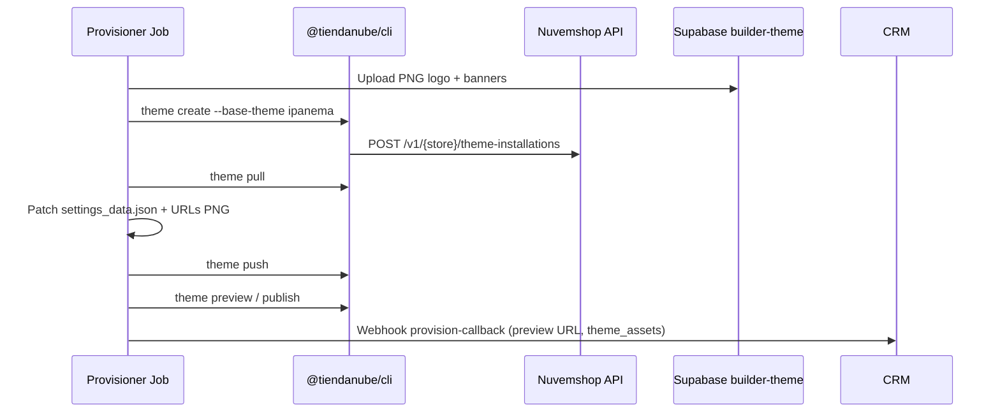

# Handoff: provisionamento Ipanema (Nuvemshop) — bloqueio HTTP 500

Documento para continuidade em outro agente (ex.: Claude). Objetivo: desbloquear `theme create` na loja piloto e corrigir o pipeline Builder/Provisioner.

**Última atualização:** 2026-05-26  
**Idioma:** pt-BR

---

## 1. Visão do projeto

| Componente | Repo / path | Porta local |
|------------|-------------|-------------|
| Builder (wizard aluno) | `crm-ascend/apps/builder` | `:3002` |
| CRM (admin, submissions) | `crm-ascend/apps/crm` | `:3001` |
| Banco / storage | Supabase (`crm-ascend/supabase/migrations`) | — |
| Provisioner (OAuth app + jobs) | `ascend-nuvemshop-provisioner` (irmão do monorepo) | `:4010` |
| Catalog API (produtos planilha) | `ascend-nuvemshop-provisioner/apps/catalog-api` | `:4011` |

Documentação de integração local: `crm-ascend/docs/builder-nuvemshop-integration.md`.

---

## 2. Loja piloto e app

| Campo | Valor |
|-------|--------|
| **Store ID** | `2251582` |
| **Nome** | Aesthetic Wrld |
| **E-mail contato** | `miniibooking@gmail.com` |
| **Plano** | `BR-plan-free` |
| **App OAuth `client_id`** | `32623` |
| **`current_theme` (API loja)** | `amazonas` |
| **Instalações produtivas** | 1 legado (Amazonas) |
| **Instalações Ipanema** | 0 |
| **`max_installations`** | 2 (há slot livre para nova instalação) |

---

## 3. Objetivo de negócio

Provisionar a loja do aluno com:

1. **20 produtos** do catálogo (nicho escolhido no wizard) — **já funciona**.
2. **Tema Ipanema** personalizado (logo, banners, cores, fonte) via fluxo oficial **CLI Nuvemshop**:
   - `theme create` (base **ipanema**) → `theme pull` → patch `settings_data.json` + assets → `theme push` → `theme publish` (ou flag `THEME_AUTO_PUBLISH`).

**Fora de escopo / não usar:**

- Tema legado **Amazonas** (personalizar via API antiga → 422).
- **FTP** ou edição manual de arquivos fora do CLI.
- Ativar Ipanema pelo **galeria clássica** do admin Nuvemshop — Ipanema é **CLI-only**, não aparece como tema clássico instalável pelo painel.

---

## 4. O que já funciona

| Etapa | Status |
|-------|--------|
| OAuth do **app** (produtos, pedidos, etc.) | OK |
| Import de **20/20 produtos** na loja piloto | OK |
| Fluxo **theme authorize** → token Base64 | OK |
| `theme list --json` com token de tema | OK |
| Upload de PNGs (logo + banners) para bucket Supabase `builder-theme` | OK |
| Sessão OAuth recente com token de tema registrado | Ver §6 |

---

## 5. Bloqueador principal (lado Nuvemshop)

### Sintoma

```text
theme create --base-theme ipanema
  → POST /v1/2251582/theme-installations
  → HTTP 500
```

### Evidências importantes

- Falha com **nosso wrapper** (`ascend-nuvemshop-provisioner`) **e** com **`@tiendanube/cli` oficial** — não é bug isolado do provisioner.
- Falha também com **`curl` direto** na mesma rota (mesmo token de tema válido).
- Com token de tema fresco e sessão correta, **`theme list`** responde; só **`create` / theme-installations** quebra.
- Loja ainda em **Amazonas** produtivo; limite de temas já causou erro em submission anterior (Beta 5), mas hoje há **slot** (`max_installations: 2`, 1 usado).

### Hipóteses a investigar (prioridade)

1. **Plano free** (`BR-plan-free`) não permite instalar tema Next-gen Ipanema via API/CLI.
2. Loja criada só com temas **legados** — API de `theme-installations` rejeita internamente (500 genérico).
3. **Partner / app** sem flag de “theme CLI” ou Ipanema habilitado para `client_id` 32623.
4. Conflito com instalação legado Amazonas (precisa migração/desinstalação antes do create).
5. Bug intermitente da API Nuvemshop — exige **request-id**, horário e corpo de resposta para suporte.

---

## 6. Sessões OAuth e submissions (`miniibooking@gmail.com`)

> **Segurança:** não colar tokens completos em tickets. Usar apenas prefixos abaixo.

### Sessões OAuth (arquivo no provisioner)

Persistência típica: `ascend-nuvemshop-provisioner/apps/.data/oauth-sessions.json`  
(cada sessão: `store_id`, tokens app, opcional `themeCliToken`).

| Sessão UUID | Uso | Token tema | Observação |
|-------------|-----|------------|------------|
| `c2885030-…` | Beta 4 | **Ausente** | Submit sem `themeCliToken` no servidor |
| `bc3798a3-…` | Beta 6 | Presente | `theme create` → 500 mesmo assim |
| **`b00c46ed-…`** | **Atual** | Registrado, prefixo `99bcc7…` | `POST /theme-auth/token` OK; usar nos próximos testes |

### Submissions (`builder_submissions`)

| Label | Submission UUID | `oauth_session_id` | Resultado |
|-------|-----------------|-------------------|-----------|
| Beta 6 | `eea5ceb2-…` | `bc3798a3-…` | Produtos OK; falha `create ipanema` 500 |
| Beta 5 | `045b54a6-…` | (ver registro) | Produtos OK; erro tema (“2 themes limit”) |
| Beta 4 | (ligada a `c2885030`) | `c2885030-…` | Sem token de tema na sessão |

**Regra para reteste:** sempre alinhar `submission_id` + `oauth_session_id` da **mesma** jornada, com `theme_authorized: true` no provisioner antes de enfileirar job.

---

## 7. Bugs reconhecidos no nosso pipeline

1. **Tokens/sessões trocados** entre testes (Beta 4 vs Beta 6 vs sessão `b00c46ed`).
2. **Beta 4:** submit com `oauth_session_id` `c2885030` **sem** `themeCliToken` persistido no provisioner.
3. **Beta 6:** sessão `bc3798a3` **com** `themeCliToken`, mas `theme create` ainda retorna 500 (confirma bloqueio upstream).
4. Tentativa antiga de usar **token OAuth do app** nas APIs de tema → **403** (escopos errados).
5. **URL de preview inventada** em algum momento (não confiar em URL que não venha de `theme preview` / job).
6. Tentativa de **personalizar Amazonas legado** via API → **422**.
7. Documentação interna antiga sugerindo que token do app bastava para CLI — **incorreto**.
8. **Builder:** `themeAuthorized` pode ficar `true` no `localStorage` após reload, sem revalidar no servidor no momento do submit — o CRM **não** valida `theme_authorized` antes de `insert_builder_submission` + enqueue (só schema Zod com `oauthSessionId`).
9. Orientação errada: “ative Ipanema no admin” — **inválido** para este produto.

---

## 8. Arquivos-chave

### crm-ascend

| Arquivo | Papel |
|---------|--------|
| `apps/builder/src/components/builder-wizard.tsx` | OAuth, theme authorize, validação `themeAuthorized`, submit |
| `apps/builder/src/lib/api.ts` | `registerThemeToken`, `fetchThemeAuthStatus`, `themeAuthorizeStartUrl` |
| `apps/builder/src/app/api/theme-token/route.ts` | Proxy → provisioner `POST /theme-auth/token` |
| `apps/builder/src/app/api/reprovision-theme/route.ts` | Proxy → CRM reprovision |
| `apps/crm/src/lib/provisioner.ts` | `enqueueProvisionerJob` → `POST :4010/jobs` |
| `apps/crm/src/app/api/builder/reprovision-theme/route.ts` | Reenfileira só tema (`theme_only: true`) |
| `apps/crm/src/app/api/builder/catalog/route.ts` | `POST` submit + enqueue provisionamento |
| `docs/builder-nuvemshop-integration.md` | Env e fluxo local |
| `supabase/migrations/008_builder_tables.sql` … `014_builder_theme_storage.sql` | Schema, RLS, bucket `builder-theme` |

### ascend-nuvemshop-provisioner (repo separado)

| Arquivo | Papel |
|---------|--------|
| `packages/nuvemshop-theme/src/apply-theme.ts` | Orquestra create → pull → patch → push → publish |
| `apps/.data/oauth-sessions.json` | Sessões OAuth + `themeCliToken` |
| Rotas `GET /theme-auth/start`, `POST /theme-auth/token`, `GET /theme-auth/status/:id` | Autorização de tema |
| `POST /jobs` | Job completo ou `theme_only` |

---

## 9. O que o próximo agente deve resolver

### 9.1 Diagnóstico Nuvemshop (P0)

- [ ] Por que `POST /v1/2251582/theme-installations` retorna **500** com base `ipanema`?
- [ ] Capturar **response body**, headers (`x-request-id` se houver) e horário UTC.
- [ ] Confirmar com doc/suporte: plano free, loja só legado, habilitação de partner para Ipanema.
- [ ] Testar em **outra loja** (conta de dev) no mesmo app `32623` para isolar loja vs app.

### 9.2 Correções no pipeline (P1)

- [ ] No **submit** (`apps/crm/.../catalog/route.ts` ou provisioner): recusar enqueue se `GET /theme-auth/status/{oauth_session_id}` → `theme_authorized !== true`.
- [ ] No **Builder**: ao restaurar `localStorage`, revalidar `fetchThemeAuthStatus` e limpar `themeAuthorized` se falso.
- [ ] Garantir que jobs usem sempre `themeCliToken` da sessão indicada no body, nunca access token do app.
- [ ] Mensagens de erro distintas: 403 (token errado), 422 (legado), 409/limite de temas, 500 (upstream).

### 9.3 Plano B se `create` continuar bloqueado

- [ ] API de **migração** legado → Next-gen (se existir para parceiros).
- [ ] Ticket Nuvemshop com store id + app id + timestamp do 500.
- [ ] Piloto em **loja nova** já nativa Next-gen (sem Amazonas produtivo).
- [ ] Documentar limitação de plano free para alunos.

### 9.4 Teste ponta a ponta (checklist)

1. Limpar `localStorage` do Builder (`STORAGE_KEY` em `apps/builder/src/lib/types.ts`).
2. OAuth app → obter `oauth_session_id` **`b00c46ed-…`** (ou nova sessão).
3. Theme authorize → colar token → `POST /theme-auth/token` → status `theme_authorized: true`.
4. CLI: `theme list --json` (deve listar instalações).
5. CLI: `theme create --base-theme ipanema` (bloqueio atual).
6. Se (5) passar: rodar job provisioner ou reprovision (§10).
7. Validar PNGs públicos no bucket e `settings_data.json` na instalação rascunho.
8. `theme publish` ou `THEME_AUTO_PUBLISH=true` conforme política.

---

## 10. Ambiente e comandos de reprodução

### 10.1 Subir stack local

```bash
# Terminal 1 — catalog
cd ../ascend-nuvemshop-provisioner
pnpm install && pnpm dev:catalog    # :4011

# Terminal 2 — provisioner
cp .env.example .env
# NUVEMSHOP_CLIENT_ID=32623, NUVEMSHOP_CLIENT_SECRET=..., NUVEMSHOP_MOCK=false
pnpm dev                            # :4010

# Terminal 3 — CRM
cd crm-ascend && pnpm --filter @crm-ascend/crm dev   # :3001

# Terminal 4 — Builder
cd crm-ascend && pnpm --filter @crm-ascend/builder dev  # :3002
```

Migrations Supabase (mínimo): `008` … `014`, em especial `010_builder_provision.sql` e `014_builder_theme_storage.sql`.

### 10.2 Variáveis (.env exemplos)

**CRM (`apps/crm/.env`):**

```env
PROVISIONER_API_URL=http://localhost:4010
PROVISIONER_API_KEY=dev-provisioner-key
CRM_WEBHOOK_SECRET=dev-secret
SUPABASE_URL=https://<project>.supabase.co
SUPABASE_SERVICE_ROLE_KEY=<service-role>
```

**Builder (`apps/builder/.env`):**

```env
CRM_URL=http://localhost:3001
PROVISIONER_URL=http://localhost:4010
NEXT_PUBLIC_PROVISIONER_URL=http://localhost:4010
```

**Provisioner:**

```env
NUVEMSHOP_MOCK=false
NUVEMSHOP_CLIENT_ID=32623
NUVEMSHOP_CLIENT_SECRET=<secret>
PROVISIONER_PUBLIC_URL=http://localhost:4010
CATALOG_API_URL=http://localhost:4011
THEME_AUTO_PUBLISH=false
SUPABASE_URL=https://<project>.supabase.co
SUPABASE_SERVICE_ROLE_KEY=<service-role>
BUILDER_THEME_BUCKET=builder-theme
```

Redirect OAuth app: `http://localhost:4010/oauth/callback`.

### 10.3 Registrar token de tema (sessão atual)

Substituir `SESSION_UUID` por `b00c46ed-…` e `THEME_TOKEN` pelo Base64 completo (não commitar).

```bash
curl -sS -X POST "http://localhost:4010/theme-auth/token" \
  -H "Content-Type: application/json" \
  -d '{"oauth_session_id":"SESSION_UUID","theme_token":"THEME_TOKEN"}'

curl -sS "http://localhost:4010/theme-auth/status/SESSION_UUID"
# Esperado: { "theme_authorized": true, "store_id": "2251582" }
```

Via Builder (proxy):

```bash
curl -sS -X POST "http://localhost:3002/api/theme-token" \
  -H "Content-Type: application/json" \
  -d '{"oauth_session_id":"SESSION_UUID","theme_token":"THEME_TOKEN"}'
```

### 10.4 CLI Nuvemshop (reproduzir 500)

Exportar credenciais conforme doc oficial (`@tiendanube/cli`). Usar **token de tema** (Base64 da página authorize), não o access token do app.

```bash
# Listar (deve funcionar)
npx @tiendanube/cli theme list --store 2251582 --json

# Bloqueador
npx @tiendanube/cli theme create --store 2251582 --base-theme ipanema

# Equivalente API (ajustar host e Authorization conforme doc CLI)
curl -sS -w "\nHTTP %{http_code}\n" -X POST \
  "https://api.nuvemshop.com.br/v1/2251582/theme-installations" \
  -H "Authentication: bearer <THEME_TOKEN_PREFIX>…" \
  -H "Content-Type: application/json" \
  -d '{"base_theme":"ipanema"}'
```

> O header exato (`Authentication` vs `Authorization`) deve seguir a versão do CLI em uso; copiar do trace do CLI com `--verbose` se necessário.

### 10.5 Enfileirar job completo ou só tema

**Novo submit (via Builder → CRM):** fluxo normal no wizard passo 9 → `POST http://localhost:3001/api/builder/catalog`.

**Reprovisionar só tema** (submission Beta 6 ou nova):

```bash
# Direto no CRM
curl -sS -X POST "http://localhost:3001/api/builder/reprovision-theme" \
  -H "Content-Type: application/json" \
  -d '{
    "submission_id": "eea5ceb2-0000-0000-0000-000000000000",
    "oauth_session_id": "b00c46ed-0000-0000-0000-000000000000"
  }'

# Via Builder (proxy)
curl -sS -X POST "http://localhost:3002/api/reprovision-theme" \
  -H "Content-Type: application/json" \
  -d '{
    "submission_id": "eea5ceb2-0000-0000-0000-000000000000",
    "oauth_session_id": "b00c46ed-0000-0000-0000-000000000000"
  }'
```

Substituir UUIDs pelos reais do Supabase. O CRM chama `enqueueProvisionerJob` com `theme_only: true` e reseta `provision_status` para `queued`.

**Job manual no provisioner:**

```bash
curl -sS -X POST "http://localhost:4010/jobs" \
  -H "Content-Type: application/json" \
  -H "x-api-key: dev-provisioner-key" \
  -d '{
    "submission_id": "<submission-uuid>",
    "oauth_session_id": "b00c46ed-...",
    "theme_only": true,
    "visual": {
      "storeName": "...",
      "niche": "Pet",
      "primaryColor": "#000000",
      "secondaryColor": "#ffffff",
      "fontId": "montserrat",
      "logoSvg": "<svg>...</svg>",
      "bannerSvgs": ["<svg>", "<svg>", "<svg>"]
    }
  }'
```

### 10.6 Consultas úteis

```bash
# Catálogo builder
curl -sS "http://localhost:3001/api/builder/catalog"

# Status provisionamento (ajustar rota conforme implementação)
curl -sS "http://localhost:3001/api/builder/provision-status?submission_id=<uuid>"

# Produtos catalog API
curl -sS "http://localhost:4011/v1/niches/pet/products"
```

---

## 11. Fluxo esperado (Provisioner) — referência

Quando `theme create` funcionar, `apply-theme.ts` (repo provisioner) deve seguir:



Hoje o fluxo **para no primeiro POST** com HTTP 500.

---

## 12. Documentação Nuvemshop no monorepo

Espelho local (não substitui doc oficial ao vivo):

- `crm-ascend/docs/tiendanube-api/` — inclui guias de autenticação e recursos de loja.
- Procurar por “theme”, “installation”, “CLI” nos guias de parceiro.

---

## 13. Critérios de sucesso

1. `theme create --base-theme ipanema` retorna **201/200** na loja `2251582` (ou decisão documentada de usar outra loja piloto).
2. Job provisioner conclui com `provision_status: completed`, `store_preview_url` válida (origem CLI).
3. Vitrine exibe logo/banners/cores do wizard (PNG do bucket `builder-theme`).
4. Submit Builder não passa sem `theme_authorized` confirmado no servidor.
5. Runbook de teste com sessão `b00c46ed` (ou sucessora) reproduzível por outro dev.

---

## 14. Perguntas objetivas para Nuvemshop / produto

1. O plano **`BR-plan-free`** permite `theme-installations` com base **`ipanema`**?
2. Lojas com **`current_theme: amazonas`** e instalação legado produtiva precisam de migração antes do create?
3. O app parceiro **`32623`** está habilitado para Theme API / CLI na conta da loja `2251582`?
4. O 500 em `POST /v1/2251582/theme-installations` tem causa conhecida ou ticket aberto?

---

*Fim do handoff. Não incluir tokens completos em commits ou neste arquivo.*
