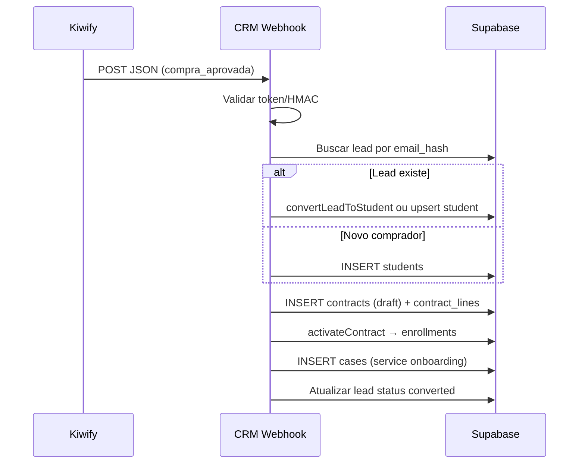

# Kiwify API — Referência consolidada

> Documentação espelhada de https://docs.kiwify.com.br/api-reference/general  
> Índice oficial LLM: https://docs.kiwify.com.br/llms.txt  
> OpenAPI (API de vendas): https://docs.kiwify.com.br/api-reference/openapi.json  
> Baixada em: 2026-06-02

---

## Sumário

1. [Visão geral](#1-visão-geral)
2. [Autenticação OAuth](#2-autenticação-oauth)
3. [Conta](#3-conta)
4. [Produtos](#4-produtos)
5. [Vendas](#5-vendas)
6. [Estatísticas](#6-estatísticas)
7. [Financeiro](#7-financeiro)
8. [Afiliados](#8-afiliados)
9. [Webhooks (API + eventos)](#9-webhooks-api--eventos)
10. [Eventos (ingressos)](#10-eventos-ingressos)
11. [API Conta Digital (banking)](#11-api-conta-digital-banking)
12. [Área de Membros (temas Liquid)](#12-área-de-membros-temas-liquid)
13. [Integração CRM Ascend (plano)](#13-integração-crm-ascend-plano)

---

## 1. Visão geral

### URL base

```
https://public-api.kiwify.com/v1/
```

- API **REST**, somente **HTTPS**
- Respostas em **JSON**
- Datas em **ISO 8601** (ex.: `2023-10-31T16:53:05.119Z`; FAQ também cita `2020-07-10 15:00:00.000`)

### Headers obrigatórios (endpoints autenticados)

| Header | Valor |
|--------|--------|
| `Authorization` | `Bearer {access_token}` |
| `x-kiwify-account-id` | ID da conta (dashboard → Apps → API, junto com a API Key) |

### Rate limit

- **100 requisições/minuto**
- Excedido → HTTP **429**

### Códigos HTTP

| Código | Significado |
|--------|-------------|
| 200 | Sucesso |
| 400 | Erro do cliente (parâmetros, token inválido) |
| 404 | Recurso não encontrado |
| 429 | Rate limit |
| 500 | Erro no servidor Kiwify → infoprodutores@kiwify.com.br |

### Scopes OAuth

`stats`, `products`, `events`, `sales`, `sales_refund`, `financial`, `affiliates`, `webhooks`

### Onde obter credenciais

Dashboard → **Apps → API → Criar API Key** → copiar `client_id`, `client_secret` e `account_id`.

> O `client_secret` expira em **96 horas**. Gere o token OAuth uma vez e reutilize até expirar; não regenere antes de cada chamada.

---

## 2. Autenticação OAuth

### POST `/oauth/token`

Gera o Bearer token para todos os outros endpoints.

**Content-Type:** `application/x-www-form-urlencoded`

| Campo | Obrigatório | Descrição |
|-------|-------------|-----------|
| `client_id` | sim | UUID da API Key |
| `client_secret` | sim | Secret exibido ao criar a key |

**Resposta 200:**

```json
{
  "access_token": "eyJhbGci...",
  "token_type": "Bearer",
  "expires_in": "86400",
  "scope": "stats products events sales sales_refund financial affiliates webhooks"
}
```

**Erro 400:**

```json
{
  "error": "auth_error",
  "message": "Invalid client: client is invalid"
}
```

---

## 3. Conta

### GET `/account-details`

**Scope:** `stats`

Retorna dados da conta e entidades legais.

**Exemplo de resposta:**

```json
{
  "id": "XvS0qfkdzCZTg8z",
  "company_name": "Teste LTDA",
  "director_cpf": "99999999999",
  "company_cnpj": "99999999999999",
  "legal_entities": [
    {
      "id": "d644de3d-9a02-46b1-aed4-72785fe8828f",
      "active": true,
      "company_name": "Teste LTDA",
      "director_cpf": "99999999999",
      "company_cnpj": "",
      "pix_key": "99999999999",
      "created_at": "2023-05-31T12:23:59.746Z",
      "updated_at": "2023-09-27T18:10:37.697Z"
    }
  ]
}
```

---

## 4. Produtos

### GET `/products`

**Scope:** `products`

| Query | Descrição |
|-------|-----------|
| `page_size` | Tamanho da página |
| `page_number` | Número da página |

**Campos típicos em `data[]`:**

| Campo | Exemplo | Descrição |
|-------|---------|-----------|
| `id` | UUID | ID do produto |
| `name` | Produto teste | Nome |
| `type` | `membership` | Tipo |
| `created_at` | ISO 8601 | Criação |
| `currency` | BRL | Moeda |
| `price` | null | Preço (pode ser null em recorrente) |
| `affiliate_enabled` | false | Afiliados habilitados |
| `status` | active | Status |
| `payment_type` | recurring | Pagamento |

### GET `/products/{id}`

**Scope:** `products` — detalhes de um produto.

---

## 5. Vendas

### GET `/sales`

**Scope:** `sales`

Lista vendas. **Período máximo entre `start_date` e `end_date`: 90 dias.**

| Query | Obrigatório | Descrição |
|-------|-------------|-----------|
| `start_date` | sim | Início do período |
| `end_date` | sim | Fim do período |
| `status` | não | Ver enum abaixo |
| `payment_method` | não | `boleto`, `credit_card`, `pix` |
| `product_id` | não | Filtrar produto |
| `affiliate_id` | não | Filtrar afiliado |
| `view_full_sale_details` | não | boolean — inclui payment, tracking, etc. |
| `updated_at_start_date` | não | Filtro por atualização |
| `updated_at_end_date` | não | Filtro por atualização |
| `page_size`, `page_number` | não | Paginação |

**Status de venda (`status`):**

`approved`, `authorized`, `chargedback`, `paid`, `pending`, `pending_refund`, `processing`, `refunded`, `refund_requested`, `refused`, `waiting_payment`

**Resposta paginada:**

```json
{
  "pagination": { "count": 10, "page_number": 1, "page_size": 10 },
  "data": [ { "...": "SaleSummary ou SaleDetails" } ]
}
```

**Objeto `customer` (resumo):**

```json
{
  "id": "29eb9963-8f4f-4c03-9897-63bdba0d5eb2",
  "name": "my customer",
  "email": "mycustomer@mail.com",
  "cpf": "99999999999",
  "cnpj": "99999999999999",
  "mobile": "+5599999999999",
  "instagram": "y_instagram",
  "country": "BR",
  "address": {
    "street": "Rua Danilo",
    "number": "407",
    "complement": "Apt. 123",
    "neighborhood": "Jardim dos Jardineiros",
    "city": "Paulista",
    "state": "SE",
    "zipcode": "46121-175"
  }
}
```

**Com `view_full_sale_details=true`**, campos adicionais incluem:

- `approved_date`, `boleto_url`, `card_last_digits`, `card_type`, `installments`
- `payment`: `charge_amount`, `charge_currency`, `net_amount`, `fee`, `sale_tax_rate`, etc.
- `tracking`: UTMs (`utm_source`, `utm_medium`, `utm_campaign`, `utm_content`, `utm_term`), `src`, `sck`, `s1`, `s2`, `s3`
- `revenue_partners`, `affiliate_commission`, `refunded_at`, `sale_type`, `two_cards`

### GET `/sales/{id}`

**Scope:** `sales` — detalhe completo de uma venda (`order_id` = `id`).

### POST `/sales/{id}/refund`

**Scope:** `sales_refund`

**Body opcional:**

```json
{ "pixKey": "99999999999" }
```

**Resposta:**

```json
{ "refunded": true }
```

---

## 6. Estatísticas

### GET `/stats`

**Scope:** `stats`

| Query | Descrição |
|-------|-----------|
| `start_date` | Início |
| `end_date` | Fim |
| `product_id` | Filtrar produto |

**Resposta:**

```json
{
  "credit_card_approval_rate": 50,
  "total_sales": 3,
  "total_net_amount": 25956,
  "refund_rate": 25,
  "chargeback_rate": 0,
  "total_boleto_generated": 2,
  "total_boleto_paid": 1,
  "boleto_rate": 50
}
```

---

## 7. Financeiro

### GET `/balance`

**Scope:** `financial` — todos os saldos da conta.

### GET `/balance/{legal_entity_id}`

**Scope:** `financial` — saldo de entidade legal específica.

### GET `/payouts` e GET `/payouts/`

**Scope:** `financial` — listar saques.

### POST `/payouts/`

**Scope:** `financial` — solicitar saque (síncrono; status final no dashboard → Financeiro → Saques).

### GET `/payouts/{id}`

**Scope:** `financial` — detalhe de um saque.

---

## 8. Afiliados

### GET `/affiliates`

**Scope:** `affiliates` — listar afiliados (paginado).

### GET `/affiliates/{id}`

**Scope:** `affiliates` — detalhe.

### PUT `/affiliates/{id}`

**Scope:** `affiliates` — editar afiliado.

---

## 9. Webhooks (API + eventos)

Existem **dois caminhos** para webhooks:

1. **Dashboard:** Apps → Webhooks → Criar Webhook (com teste e logs)
2. **API REST:** CRUD em `/webhooks` (programático)

A Kiwify envia payloads em **JSON** via POST para a URL configurada. A documentação oficial da API **não publica o schema completo do body inbound**; na prática o payload espelha campos de venda/cliente (ex.: `Customer`, `Commissions`, `Subscription` em integrações da comunidade). Use **Testar Webhook** no painel e **Ver logs** para capturar exemplos reais.

Integrações comuns validam autenticidade via **token HMAC** configurado no webhook (campo `token` na API / painel).

### Triggers disponíveis

| Trigger | Uso típico no CRM |
|---------|-------------------|
| `compra_aprovada` | Criar aluno + contrato ativo + caso onboarding |
| `carrinho_abandonado` | Enriquecer lead, remarketing, status abandono |
| `compra_recusada` | Lead quente com pagamento falho |
| `boleto_gerado` | Follow-up financeiro |
| `pix_gerado` | Follow-up pagamento pendente |
| `compra_reembolsada` | Cancelar enrollment / caso financeiro |
| `chargeback` | Caso financeiro urgente |
| `subscription_canceled` | Encerrar acesso recorrente |
| `subscription_late` | Cobrança / retenção |
| `subscription_renewed` | Renovação de contrato |

### API — POST `/webhooks`

**Scope:** `webhooks`

**Body:**

```json
{
  "name": "CRM Ascend",
  "url": "https://crm.example.com/api/webhooks/kiwify",
  "products": "all",
  "triggers": [
    "compra_aprovada",
    "carrinho_abandonado",
    "compra_recusada",
    "pix_gerado",
    "boleto_gerado"
  ],
  "token": "seu-token-secreto"
}
```

- `products`: UUID de produto ou `"all"`
- `token`: string opcional para validação no receptor

**Resposta:** objeto `Webhook` com `id`, `name`, `url`, `products`, `triggers`, `token`, `created_at`, `updated_at`.

### API — demais endpoints

| Método | Path | Descrição |
|--------|------|-----------|
| GET | `/webhooks` | Listar (filtros: `product_id`, `search`, paginação) |
| GET | `/webhooks/{id}` | Consultar |
| PUT | `/webhooks/{id}` | Atualizar |
| DELETE | `/webhooks/{id}` | Excluir (204) |

### Webhooks banking (Conta Digital)

Endpoints separados em `/api-reference/banking/` e `/api-reference/webhooks/criar-assinatura-de-webhook.md` — assinatura Ed25519, eventos Pix/boleto/transferência. **Não confundir** com webhooks de vendas acima.

### Painel — operação

- Criar: Apps → Webhooks
- Testar: botão **Testar Webhook**
- Logs: ⋮ → Ver logs → reenviar falhas
- Afiliados: webhooks funcionam, mas dados PII do comprador dependem da permissão do produtor

---

## 10. Eventos (ingressos)

### GET `/events/{product_id}/participants`

**Scope:** `events`

Para produtos tipo evento/ingresso. Filtros: `checked_in`, datas, `external_id`, `batch_id`, `phone`, `cpf`, `order_id`, paginação.

**Resposta inclui:**

```json
{
  "pagination": { "...": "..." },
  "data": {
    "max_tickets": 10,
    "available": 7,
    "issued_tickets": 3,
    "sold_tickets": 2,
    "total_checkin": 0,
    "participants": [
      {
        "id": "ae1603c9-eeda-41c5-84a2-6bffb7c4b333",
        "external_id": "YRC3IQGCR24TWKT",
        "batch_id": "...",
        "batch_name": "lote 1",
        "name": "Manual",
        "email": "mycustomer@mail.com",
        "cpf": "64365501194",
        "phone": "8229453509",
        "order_id": "44db0fe3-ac96-4895-8a72-8f128e9664a9",
        "checkin_at": null,
        "created_at": "2023-11-24T10:30:04.855Z",
        "updated_at": "2023-11-24T10:30:04.855Z"
      }
    ]
  }
}
```

---

## 11. API Conta Digital (banking)

API separada para **Conta Digital Kiwify** (Pix, extrato, boletos, QR codes). Base documentada em `/api-reference/banking/overview.md`.

Autenticação: **EdDSA Proof-of-Possession** (par de chaves Ed25519), não OAuth da API de vendas.

OpenAPI banking: https://docs.kiwify.com.br/api-reference/banking/openapi.pt.json

Principais grupos (ver `llms.txt`):

| Grupo | Endpoints |
|-------|-----------|
| Conta | saldo, limites, chaves Pix |
| Enviar Pix | transferências |
| Receber Pix | reembolsos |
| QR Codes Pix | dinâmicos |
| Extrato | transações, pagamentos agendados |
| Pagar boletos | pagamento de boleto |
| Webhooks banking | assinaturas, chaves públicas, payloads CASHIN/CASHOUT |

> Para integração CRM de **vendas de infoproduto**, use a API de vendas + webhooks de compra; a banking API só entra se operarem movimentação financeira direta na Conta Digital.

---

## 12. Área de Membros (temas Liquid)

Documentação em `/members-area/` — personalização de temas da área de membros (Liquid, sections, snippets, templates, filters, objects). **Fora do escopo** da integração CRM de vendas/onboarding, salvo se o onboarding incluir customização de tema.

---

## 13. Integração CRM Ascend (plano)

### Estado atual no repositório

| Peça | Onde | O que faz |
|------|------|-----------|
| Lead pré-checkout | `apps/landing` → `POST /api/sales/lead` | Captura e-mail/telefone antes do checkout Kiwify |
| `reached_kiwify_at` | tabela `leads` | Marca que o lead foi ao checkout |
| Jornada landing | `apps/crm/src/lib/landing-journey.ts` | Timeline de abandono vs checkout |
| Checkout URL | `https://pay.kiwify.com.br/26ERa3r` | Link de pagamento |
| Aluno | `students` | PII + hashes; status `prospect` → ativo via contrato |
| Contrato | `createContract` + `activateContract` | Linhas de produto + enrollments |
| Casos | `cases` + `services.code` | Ex.: `COMERCIAL`, `PED-SUPORTE`, `FIN-BOLETO` |
| Conversão manual | `convertLeadToStudent` | Lead → aluno |

**Ainda não existe:** rota `POST /api/webhooks/kiwify` nem job de sync.

### Fluxo alvo — `compra_aprovada`



**Mapeamento de campos Kiwify → CRM:**

| Kiwify | CRM |
|--------|-----|
| `customer.email` | `students.email` / `email_hash` |
| `customer.name` | `students.full_name` |
| `customer.mobile` | `students.phone` / `phone_hash` |
| `customer.cpf` / `cnpj` | documento (hash se necessário) |
| `product.id` | mapear para `products` via metadata `kiwify_product_id` |
| `payment.charge_amount` | `contract_lines.unit_price_cents` |
| `tracking.*` | `leads.utm` / `quiz_answers` |
| `id` (order) | idempotência: `external_refs.kiwify_order_id` |

**Serviço de onboarding sugerido:** criar seed `ONBOARDING` em `services` ou reutilizar `PED-SUPORTE` com subject `Onboarding: {produto}`.

### Fluxo alvo — `carrinho_abandonado`

1. Receber webhook com e-mail/telefone (se disponível no payload).
2. Correlacionar com `leads.email_hash` / sessão landing (`landing_sessions`).
3. Atualizar lead: status mais quente, `quiz_answers.kiwify_abandoned_at`, produto/carrinho.
4. **Não** criar aluno ainda — apenas enriquecer funil (complementa tracking atual da landing).

### Fluxo alvo — pagamentos pendentes

| Evento | Ação CRM |
|--------|----------|
| `pix_gerado` / `boleto_gerado` | Caso `FIN-BOLETO` ou tag no lead |
| `compra_recusada` | Lead quente + caso comercial opcional |
| `compra_reembolsada` / `chargeback` | Suspender enrollment + caso financeiro |

### Implementação recomendada (próxima fase)

1. **Env:** `KIWIFY_CLIENT_ID`, `KIWIFY_CLIENT_SECRET`, `KIWIFY_ACCOUNT_ID`, `KIWIFY_WEBHOOK_TOKEN`
2. **Rota:** `apps/crm/src/app/api/webhooks/kiwify/route.ts`
3. **Cliente OAuth:** cache de token com refresh antes de `expires_in`
4. **Idempotência:** tabela ou coluna JSON em `students`/`contracts` para `kiwify_order_id`
5. **Produto:** coluna `metadata.kiwify_product_id` em `products` para mapear SKU CRM
6. **Webhook via API:** registrar URL de produção com triggers necessários
7. **Backfill opcional:** cron `GET /sales?updated_at_*` para recuperar vendas perdidas (janela 90 dias)

### Referências úteis

- [Como funcionam os webhooks (ajuda Kiwify)](https://ajuda.kiwify.com.br/pt-br/article/como-funcionam-os-webhooks-2ydtgl/)
- [Criar webhook (API)](https://docs.kiwify.com.br/api-reference/webhooks/create)
- [Listar vendas (API)](https://docs.kiwify.com.br/api-reference/sales/list)

---

## Apêndice A — Tabela de endpoints (API de vendas)

| Método | Path | Tag | Scope |
|--------|------|-----|-------|
| POST | `/oauth/token` | Autenticação | — |
| GET | `/account-details` | Conta | stats |
| GET | `/products` | Produtos | products |
| GET | `/products/{id}` | Produtos | products |
| GET | `/sales` | Vendas | sales |
| GET | `/sales/{id}` | Vendas | sales |
| POST | `/sales/{id}/refund` | Vendas | sales_refund |
| GET | `/stats` | Vendas | stats |
| GET | `/balance` | Financeiro | financial |
| GET | `/balance/{legal_entity_id}` | Financeiro | financial |
| GET | `/payouts` | Financeiro | financial |
| POST | `/payouts/` | Financeiro | financial |
| GET | `/payouts/{id}` | Financeiro | financial |
| GET | `/affiliates` | Affiliados | affiliates |
| GET | `/affiliates/{id}` | Affiliados | affiliates |
| PUT | `/affiliates/{id}` | Affiliados | affiliates |
| GET | `/webhooks` | Webhooks | webhooks |
| POST | `/webhooks` | Webhooks | webhooks |
| GET | `/webhooks/{id}` | Webhooks | webhooks |
| PUT | `/webhooks/{id}` | Webhooks | webhooks |
| DELETE | `/webhooks/{id}` | Webhooks | webhooks |
| GET | `/events/{product_id}/participants` | Eventos | events |

---

## Apêndice B — Índice completo docs.kiwify.com.br

Gerado a partir de `https://docs.kiwify.com.br/llms.txt`:

**API vendas:** account, affiliates, auth, finance, general, products, sales, webhooks, events

**API banking:** authentication, key-generation, overview, service-accounts, conta, enviar-pix, receber-pix, qr-codes-pix, extrato, pagar-boletos, webhooks banking

**Área de membros:** general, key-concepts, reference (liquid, filters, objects, tags, schema)

OpenAPI specs: `openapi.json` (vendas), `banking/openapi.pt.json` (conta digital)
