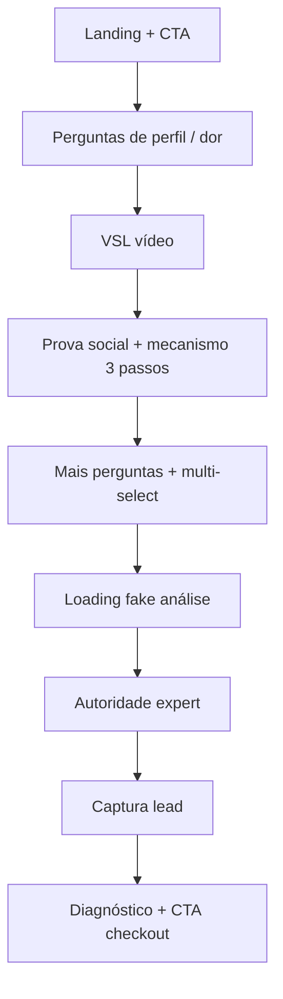

# Mapeamento de funis quiz — Iagor Gonçalves vs Rafael Bottrel

> Coleta via navegação automatizada (Playwright/Chromium) renderizando JavaScript, em 05/06/2026.  
> **Plataforma dos dois:** [InLead Digital](https://inlead.digital) (Next.js, conteúdo criptografado no SSR, SPA no client).

---

## Resumo executivo

| | **Iagor Gonçalves** | **Rafael Bottrel** |
|---|---|---|
| **URL** | https://quiz.iagor-goncalves.com/ | https://plano.bottrel.com.br/ |
| **Nome interno** | PVG - FB BR V3 | (funil Meta / Instagram) |
| **Promessa principal** | Plano individual + loja pronta → **R$841 a R$1.621 / 7 dias** | Sócio em loja online → **PIX semanais R$2.554** |
| **Prova social** | Wix, +100k alunos, +R$1 bi faturado | +1.346 alunos em 2026, R$6.300/mês (8/10 alunos 18–29) |
| **Entrada do funil** | Escolha de gênero (Homem / Mulher) | CTA **COMEÇAR AGORA →** |
| **Captura de lead** | Nome (e etapas seguintes após diagnóstico) | Não percorrido até o fim nesta coleta* |
| **Página de resultado** | Diagnóstico **ALTO POTENCIAL** + gráfico R$841–R$1.621 + **VER MEU PLANO COMPLETO** | Não alcançada nesta coleta* |

\* O funil Bottrel foi mapeado até a etapa 13 (multi-select de dias da semana). Estrutura e copy das etapas intermediárias estão completas abaixo.

---

## Esquema técnico (InLead)

Ambos os sites compartilham o mesmo padrão:

- **Stack:** Next.js hospedado em `inlead.digital`, domínio customizado (CNAME).
- **Dados:** JSON criptografado em `__NEXT_DATA__` (campo `q`) — não é possível extrair o funil completo via HTML estático.
- **Tipos de bloco observados:**
  - **Landing** — headline + subtítulo + CTA
  - **Pergunta única** — cards clicáveis (`button` com título + subtítulo)
  - **Pergunta múltipla** — “Escolha até X” / “Escolha todas” + botão Continuar
  - **Conteúdo / VSL** — vídeo + aviso “assista antes de continuar”
  - **Prova social dinâmica** — texto personalizado com resposta anterior (ex.: faixa etária)
  - **Storytelling** — blocos longos + CONTINUAR
  - **Loading fake** — barras “Analisando… / Calculando… / Cruzando…”
  - **Autoridade** — bio do expert + foto/evento
  - **Formulário** — input + CONTINUAR
  - **Resultado** — diagnóstico + projeção financeira + CTA final

- **UTM (Bottrel):** `utm_source=meta`, `utm_medium`, `utm_campaign`, `utm_content`, `utm_term=Instagram_Feed`, `fbclid`.

---

# FUNIL 1 — Iagor Gonçalves

**URL:** https://quiz.iagor-goncalves.com/

## Etapa 0 — Landing

**Headline:**
> RECEBA UM PLANO INDIVIDUAL E UMA LOJA ONLINE PRONTA PRA FATURAR DE R$841 A R$1621 A CADA 7 DIAS

**Subheadline:**
> Eu vou calcular seu potencial de faturamento semanal e te entregar um plano personalizado + loja pronta sem estoque 🤑

**Pergunta:** Escolha seu gênero pra começar ⬇️

**Opções:**
- Homem
- Mulher

---

## Etapa 1 — Entendendo o seu momento

**Pergunta:** Qual frase melhor descreve sua situação hoje?

**Opções:**
1. Trabalho muito e ganho pouco pro tanto que me esforço
2. Tenho um trabalho ok, mas sei que posso mais
3. Estou estudando e quero começar a ganhar meu próprio dinheiro
4. Estou sem renda fixa e preciso resolver isso rápido
5. Já empreendo, mas quero uma nova fonte de receita

---

## Etapa 2 — O que você realmente quer

**Pergunta:** Se você pudesse mudar UMA coisa na sua vida financeira agora, o que seria?

**Opções (título + subtítulo):**
1. Ter uma renda extra de R$5.000/mês — *Sem largar o que faço*
2. Sair do meu trabalho atual — *E ter controle total sobre meu tempo*
3. Ganhar dinheiro no automático — *Mesmo quando eu não estiver trabalhando*
4. Ganhar dinheiro de verdade — *E viver tranquilo pela primeira vez*

---

## Etapa 3 — Sua vida financeira (sentimento)

**Pergunta:** Seja honesto: como você se sente em relação ao dinheiro que entra hoje?

**Opções:**
1. Não dá pra nada... — *Mês acaba antes do salário*
2. Dá pra sobreviver — *Mas não sobra quase nada*
3. Ate dá pra viver — *Mas tenho zero folga pra realizar o que quero*
4. Ganho bem — *Mas quero muito mais 💸*

---

## Etapa 4 — Sua vida financeira (incômodo)

**Pergunta:** E o que mais te incomoda nessa situação?

**Opções:**
1. Trocar meu tempo por um salário que não muda nunca
2. Depender de chefe, horário e permissão pra viver
3. Ver gente com menos capacidade do que eu ganhando mais
4. Querer dar mais pra minha família e não conseguir

---

## Etapa 5 — Tentativas anteriores

**Pergunta:** Você já tentou fazer algo pra mudar essa situação?

**Opções:**
- Sim, já tentei algumas coisas
- Não, nunca soube por onde começar

---

## Etapa 6 — O que já tentou (condicional)

**Pergunta:** O que você já tentou?

**Opções:**
1. Vender algo pela internet (afiliados, drop, marketplaces)
2. Trabalho freelancer ou bico por fora
3. Apostar (tigrinho, day trade, aposta esportiva)
4. Curso online que prometia resultado e não entregou
5. Renda extra com app (motorista, entrega, etc)
6. Outros

---

## Etapa 7 — VSL (vídeo)

**Copy:**
> É assim que você vai ganhar dinheiro usando uma loja virtual sem estoque...
>
> Assista a este vídeo curto clicando no play ▶️
>
> Só clique em continuar, depois de assistir todo o vídeo

**CTA:** CONTINUAR

---

## Etapa 8 — Crença / prova social

**Copy:**
> Entenda uma coisa: QUALQUER PESSOA consegue ganhar dinheiro com a internet
>
> E com a loja profissional pronta e o plano personalizado que eu vou te entregar, você vai ser o próximo
>
> Você acredita nisso?
>
> *Foto do Abundance Experience, um evento exclusivo para alunos com +R$1.000.000 em vendas*

**Opção:** SIM! ACREDITO

---

## Etapa 9 — Mecanismo Wix (3 passos)

**Headline:** A Wix está pagando pra você receber uma loja virtual pronta

**Passos:**
1. Resgatar loja profissional feita por IA treinada — *criadas em minutos*
2. Colocar a loja no ar e divulgar — *primeiras vendas (depoimento aluno)*
3. Final da 1ª semana: **+R$841/semana** — *Kauã fez +R$3.000 em menos de 1 semana*

**Bullets:** renda extra consistente · 2h/dia · sem sair de casa

**CTA:** CONTINUAR

---

## Etapa 10 — Projeção de futuro (medo)

**Pergunta:** Se nada mudar nos próximos 12 meses, onde você vai estar?

**Opções:**
1. Exatamente no mesmo lugar — *Fazendo as mesmas coisas*
2. Provavelmente pior — *Porque tudo só fica mais caro · Mais cansado · Mais frustrado*
3. Não quero nem pensar nisso

---

## Etapa 11 — Perfil pessoal

**Pergunta:** Você é...

**Opções:** CLT · Empreendedor · Autônomo / PJ · Estudante · Não trabalho nem estudo no momento

---

## Etapa 12 — Storytelling e-commerce

**Copy longo:** segredo do dinheiro na internet → maioria reclama → domingo com aperto no peito → “você não quer ser a maioria” → e-commerce gerou milionários → Iagor mudou vida da família → alunos saíram do CLT, aposentaram pais, viajaram, compraram casa

**CTA:** CONTINUAR

---

## Etapa 13 — Prioridade na renda

**Pergunta:** O que seria mais importante pra você em uma nova fonte de renda?

**Opções:**
1. Poder fazer de qualquer lugar (celular/notebook)
2. Não precisar aparecer, gravar vídeo ou falar com ninguém
3. Começar rápido, sem muito dinheiro pra investir
4. Ganhar dinheiro mesmo quando não estiver trabalhando

---

## Etapa 14 — Nichos (multi-select até 4)

**Pergunta:** Com quais nichos você mais se identifica?

**Opções:**
- Moda masculina 👕
- Moda feminina 👗
- Saúde e beleza 🌿
- Tecnologia 💻️
- Casa e decoração 🏠️
- Automotivo 🚙
- Fitness 🏋️
- Pet 🐈️

**CTA:** CONTINUAR

---

## Etapa 15 — Proposta de valor (commitment)

**Copy (checklist):**
- ✅ Loja online pronta com produtos no nicho ideal
- ✅ Treinamento passo a passo
- ✅ Mentorias ao vivo com Iagor e time

**Pergunta:** Você começaria?

**Opções:**
- Com certeza! Preciso disso 🔥
- Sim, quero começar logo 🏃💨

---

## Etapa 16 — Faixa salarial

**Pergunta:** Qual sua faixa de salário hoje?

**Opções:**
- Não tenho renda mensal
- Até R$1.000
- De R$1.001 a R$2.500
- De R$2.501 a R$4.000
- De R$4.001 a R$7.000
- De R$ 7.001 a R$ 10.000
- Acima de R$10.000

---

## Etapa 17 — Loading / análise

**Copy animado:**
- Analisando suas respostas... (33%)
- Seu perfil foi aprovado para receber o plano personalizado!
- Cruzando com o perfil dos nossos melhores alunos...
- Calculando o seu potencial de faturamento...
- Gerando o seu diagnóstico personalizado...

---

## Etapa 18 — Autoridade (Iagor)

**Headline:** Quem está por trás do seu plano?

**Copy:**
> Prazer, meu nome é Iagor, sou especialista em e-commerce
>
> Comecei aos 15 anos, com -R$160 emprestados.
>
> Hoje, com apenas 21 anos, sou a maior referência de e-commerce da América Latina.
>
> Já ensinei +100.000 alunos e, juntos, eles faturaram +R$1 BILHÃO.
>
> Por conta disso, fui reconhecido pela Wix — parceiro oficial.

**CTA:** CONTINUAR

---

## Etapa 19 — Captura de nome

**Copy:** Pra eu poder personalizar o seu plano e o seu acesso...

**Campo:** Qual seu nome?

**CTA:** CONTINUAR

---

## Etapa 20 — Resultado / diagnóstico

**Headline:** Seu diagnóstico ficou pronto...

**Badge:** ALTO POTENCIAL

**Bullets:**
- ✅ Perfil com resultados mais rápidos neste sistema
- ✅ Comprometimento real com a mudança (raro)
- ✅ Nicho escolhido (ex.: moda masculina | tecnologia) entre os que mais cresceram em 90 dias

**Gráfico:** Projeção de faturamento nos primeiros 7 dias — **R$841 a R$1.621**

**CTA final:** VER MEU PLANO COMPLETO

---

# FUNIL 2 — Rafael Bottrel

**URL:** https://plano.bottrel.com.br/  
**UTM exemplo:** Meta / Instagram Feed

## Etapa 1 — Landing

**Headline:**
> Descubra como se tornar meu sócio em uma loja online e receber PIX semanais de **R$ 2.554,00**

**Subheadline:**
> Mesmo começando do zero, sem precisar aparecer, sem investir em anúncios e mesmo que você nunca tenha vendido nada online

**CTA:** COMEÇAR AGORA →

**Prova social:** ⚡ Mais de 1.346 alunos já estão lucrando com o método

---

## Etapa 2 — Idade

**Seção:** Me conte mais sobre você

**Pergunta:** Qual sua idade 👇

**Opções:**
- 18 - 29 anos
- 30 - 39 anos
- 40 - 49 anos
- + 50 anos

**Rodapé:** Feito por Rafael Bottrel — reconhecido como um dos maiores especialistas em lojas online do Brasil.

---

## Etapa 3 — Objetivo principal

**Seção:** Meu perfil

**Pergunta:** Qual é o seu principal objetivo?

**Subtexto:** Para personalizar seu plano, preciso entender o que você quer alcançar

**Opções:**
1. **Ganhar uma renda extra** — Começar a ter uma renda adicional pra viver com mais tranquilidade.
2. **Sair do CLT e trabalhar por conta própria** — Construir uma carreira online, flexível e lucrativa.
3. **Alcançar minha liberdade financeira** — Ganhar dinheiro de verdade e finalmente viver com tranquilidade.

---

## Etapa 4 — Prova social dinâmica (por idade)

**Copy personalizado (ex. 18–29):**
> Só em 2026, 1.346 alunos já estão lucrando com lojas online sem estoque seguindo o método que eu vou te mostrar.
>
> Segundo o nosso acompanhamento, **8 em cada 10 alunos com idade entre 18 - 29 anos** começaram do zero, e conquistaram uma renda extra consistente de pelo menos **R$6.300 nos primeiros meses**.
>
> Com seu plano personalizado e a loja pronta ideal, você vai ser o próximo a ter um aumento na renda.
>
> Continue respondendo pra receber tudo personalizado pra você 👇🏻

**CTA:** Continuar minha análise

---

## Etapa 5 — VSL

**Copy:**
> Descubra em detalhes como você vai ganhar dinheiro com uma loja online sem estoque...
>
> Assista ao vídeo clicando no Play, o vídeo tem menos de 3 minutos.
>
> ⚠️ Só clique em continuar depois de ver todo o vídeo.

**CTA:** Quero começar minha loja

---

## Etapa 6 — Regime de trabalho

**Pergunta:** Qual é o seu regime de trabalho?

**Opções:**
- Estou como CLT
- Sou Autônomo
- Sou Empreendedor
- Sou Estudante
- Não trabalho nem estudo no momento

**CTA:** Continuar

---

## Etapa 7 — Dia a dia atual

**Seção:** Estilo de vida e hábitos

**Pergunta:** Como você descreveria seu dia-a-dia?

**Opções:**
1. Corrido, sempre ocupado — *Dia cheio, pouco tempo livre, muitas responsabilidades*
2. Equilibrada mas sem flexibilidade — *Rotina organizada mas horários fixos e rígidos*
3. Flexível, controlo meus horários — *Tenho autonomia para organizar meu tempo*
4. Monótona, quero mais variedade — *Mesma rotina todo dia, busco mudanças*

**CTA:** Continuar

---

## Etapa 8 — Rotina desejada (multi-select)

**Pergunta:** Como gostaria que fosse sua rotina?

**Instrução:** Escolha todas as opções que você mais se identifica:

**Opções:**
- Acordar sem despertador e trabalhar no meu próprio horário
- Ter liberdade de tempo pra poder viajar mais
- Trabalhar de onde eu quiser fazendo algo que me motiva
- Ter mais tempo para família e lazer com os amigos

**CTA:** Continuar

---

## Etapa 9 — Interesses loja online (multi-select)

**Seção:** Quase lá

**Pergunta:** O que mais te interessa a trabalhar com Loja Online?

**Instrução:** Escolha todas as opções que você mais se identifica:

**Opções:**
- ✅ Viajar quando quiser
- ✅ Conquistar meu carro e casa própria
- ✅ Ter mais tempo para curtir com os amigos e família
- ✅ Conseguir minha independência financeira
- ✅ Trabalhar de casa
- ✅ Ganhar mais dinheiro

**CTA:** Continuar

---

## Etapa 10 — Mecanismo 3 passos

**Headline:** Vou te ajudar a vender todos os dias pela internet, no seu ritmo e de onde quiser.

**Bullets:**
- ✅ Ganhar dinheiro com lojas online
- ✅ Vender sem aparecer
- ✅ Ter sua independência financeira
- ✅ Viajar pelo mundo
- ✅ Curtir sua família

**Passos:**
1. Receber loja profissional pronta — configurada pelo time de especialistas
2. Colocar no ar e divulgar — primeiras vendas
3. Final da semana — **+10 vendas/dia** — *Odair faturou R$1.423,81 em um dia*

**Bullets finais:** sem estoque · sem sair de casa · sem muito tempo livre

**CTA:** Quero começar a vender!

---

## Etapa 11 — Rotina de trabalho

**Pergunta:** Como é a sua rotina de trabalho?

**Opções:**
- Horário Comercial - 8h às 18h, Segunda a Sexta
- Turnos noturnos - Trabalho à noite ou madrugada
- Meus horários são flexíveis - Controlo quando trabalho
- Não estou trabalhando no momento

**CTA:** Continuar

---

## Etapa 12 — Dias com tempo livre (multi-select, mín. 3)

**Pergunta:** Quais dias da semana você tem mais tempo livre?

**Instrução:** Escolha pelo menos 3 opções:

**Opções:** Segunda · Terça · Quarta · Quinta · Sexta · Final de Semana

**CTA:** Continuar

---

## Etapas seguintes (não capturadas até o fim)

Após a etapa 12, o funil Bottrel provavelmente segue o mesmo padrão InLead:
- Loading / análise de perfil
- Resultado personalizado
- Captura de lead (nome, e-mail, WhatsApp)
- Redirecionamento para checkout (Hotmart/Kiwify/Eduzz)

---

# Comparativo de padrões de copy

| Padrão | Iagor | Bottrel |
|--------|-------|---------|
| Promessa numérica | R$841–1.621 / 7 dias | R$2.554 PIX semanal |
| Parceiro/mecanismo | Wix + IA | “Sócio” + time especialistas |
| VSL obrigatório | Sim (CONTINUAR pós-vídeo) | Sim (Quero começar minha loja) |
| Personalização por resposta | Nichos, gênero | Idade (texto dinâmico R$6.300) |
| Medo / futuro | “12 meses sem mudar” | (menos explícito no trecho mapeado) |
| Multi-select | Nichos (até 4) | Rotina, interesses, dias (até N) |
| Expert story | Etapa dedicada Iagor + Wix | Rodapé “Feito por Rafael Bottrel” |
| Resultado | ALTO POTENCIAL + gráfico | (não alcançado) |

---

# Fluxograma simplificado

---

# Notas para replicação (Ascend)

1. **Mesma plataforma** — ambos usam InLead; clone visual exige conta/funnel lá ou rebuild manual.
2. **Ordem importa** — perguntas de dor → VSL → mecanismo → nichos → loading → resultado maximiza commitment.
3. **Textos dinâmicos** — Bottrel injeta faixa etária na prova social; Iagor injeta nichos no diagnóstico.
4. **CTAs distintos** — “CONTINUAR”, “Continuar minha análise”, “Quero começar minha loja”, “VER MEU PLANO COMPLETO”.
5. **Mobile-first** — cards grandes, subtítulos em segunda linha, emojis nos nichos/interesses.

---

*Documento gerado automaticamente a partir de navegação real nos funis. Screenshots em `/tmp/quiz-scraper/output/` (Iagor) e `/tmp/quiz-scraper/bottrel/` (Bottrel).*
